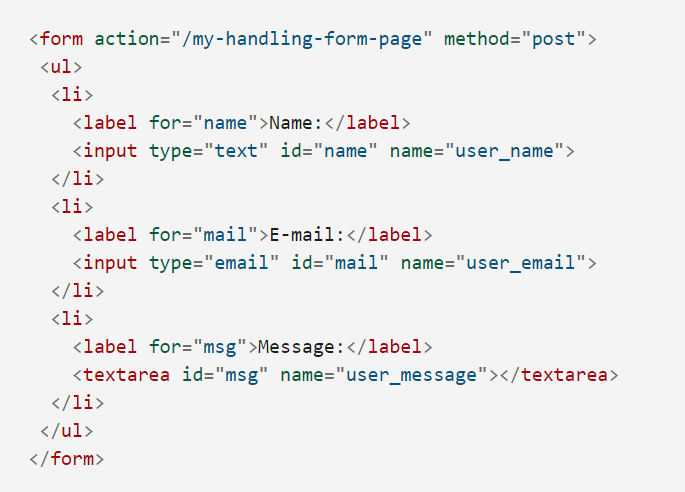

# Introduction to Forms

This exercise works through the [MDN tutorial](https://developer.mozilla.org/en-US/docs/Learn/Forms/Your_first_form) for creating your first HTML form.

# Notes

 
 

- In this example, we can use unordered lists to nicely format the inputs
- The `<label>` associates to its correspoing `<input>` control by matching `for` to `id`. This allows the user to click on the label to activate the corresponding control. Additionally, it provides enhance accessibility for screen reading functionality.
- For larger text inputs, it makes sense to use the `<textarea>` input type.
- Notice that the `type` attribute comes with a built "email" type that performs validation on the provided email. Should any validation steps fail, the form is not elligbile to be sent.
- The form data is sent to the server with `name:value` pairings. The `name` of the data is specified with `name` attribute.
