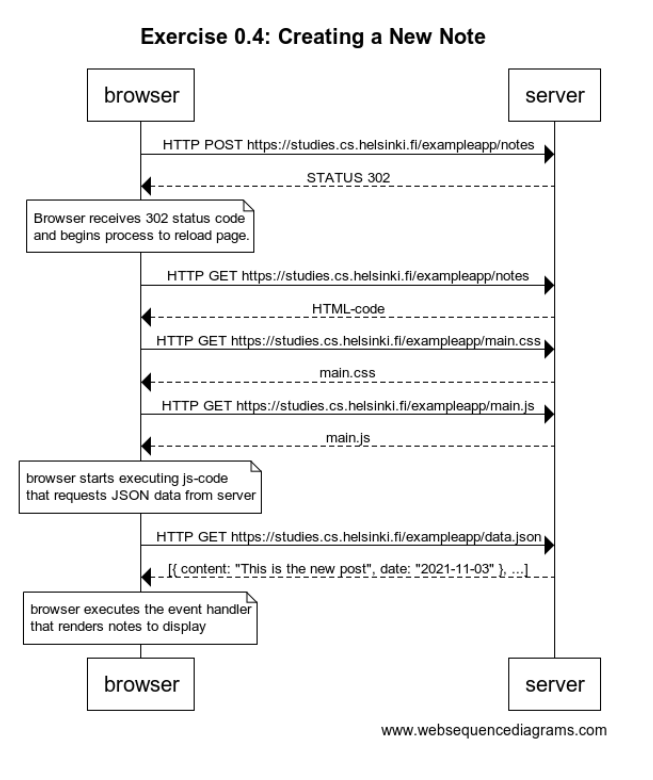

# New Note Web Sequence Diagram

The web sequence diagram for creating a new note following the general logic of:

1. Submit post request with form data
2. If status 302 is returned, then reload the page.
3. Follow the same actions for reloading the page using a series of get requests

The full diagram can be seen below:

