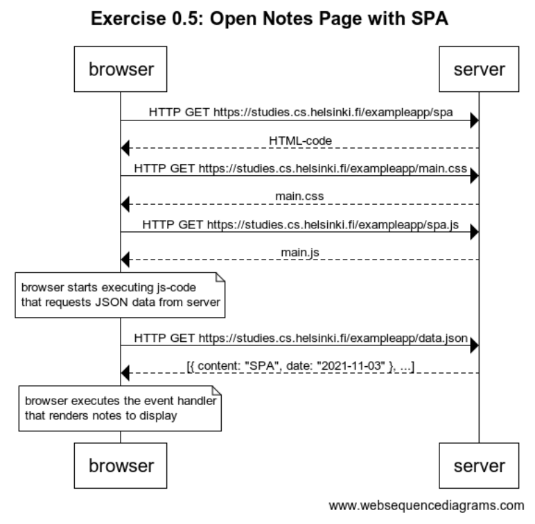

# Single Page App Web Sequence Diagram

The web sequence diagram for creating a new note using a single page application:

1. Submit post request with form data
2. Return status 201 indicating a succesful POST
3. Javascript event is triggered to append new note and display results by editing the DOM

The full diagram can be seen below:

