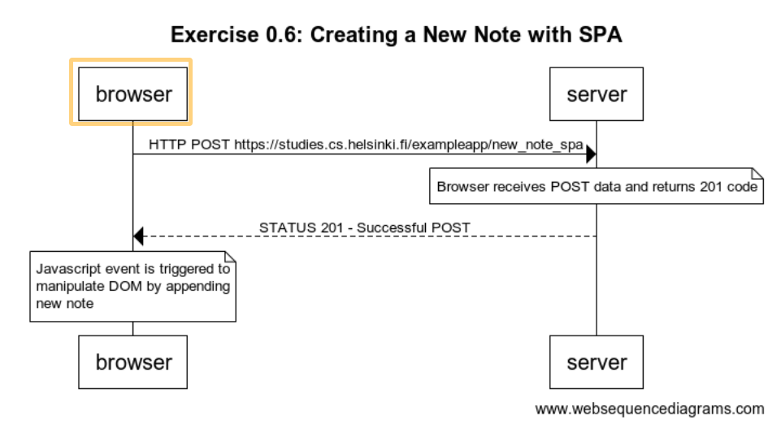

# Single Page App Web Sequence Diagram Create New Note

My submission for this exercise assumes that the page is already loaded. I only add the network sequence for submitting a new note.

1. Submit post request with form data
2. Return status 201 indicating a succesful POST
3. Javascript event is triggered to append new note and display results by editing the DOM

Main takeaway: SPA process for creating a new note is MUCH less involved.

The full diagram can be seen below:

